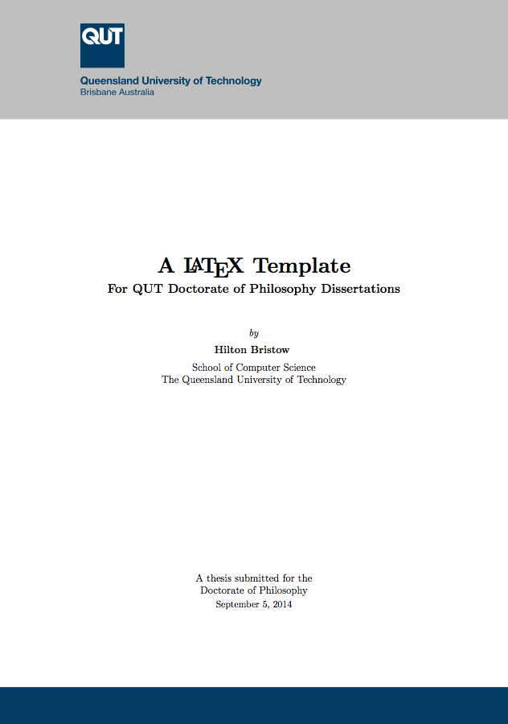

QUT Thesis
=========
A LaTeX package and template for writing a thesis/dissertation at the Queensland University of Technology (QUT)

Introduction
------------
This set of files provides the `qutthesis` LaTeX package, which defines a set of styles and preamble specific to QUT's submission guidelines for a PhD dissertation.

The `thesis.tex` file has everything you need to get started, and was used to produce the sample `thesis.pdf`. The package was designed to work with the `book` document class and the commands it provides, however it should also work with `memoir` if you prefer that.

Features
--------

 - A thesis skeleton to help get you writing
 - Chapters included using the `subfiles` package so you can compile them independently
 - A `compile` shell script which can build your whole document or a single chapter, writing intermediate files to the `build` directory to keep your working directory clean
 - Preconfigured `.gitignore` files to assist in version control
 - Margins and font size optimized for readability
 - Minimal definitions and package includes
 - Clean internal design, so you can understand what's going on

Getting started
---------------

 1. Clone the repository
  
    ```
    git clone https://github.com/hbristow/qutthesis
    ```

 2. Build the existing sources

    ```
    cd qutthesis
    ./compile
    ```

 3. Modify `thesis.tex` with your details
 4. Check out each of the `*-*.tex` files to see how chapters using `subfiles` operate


